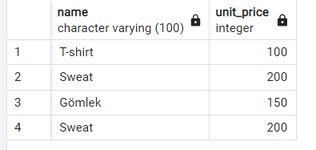
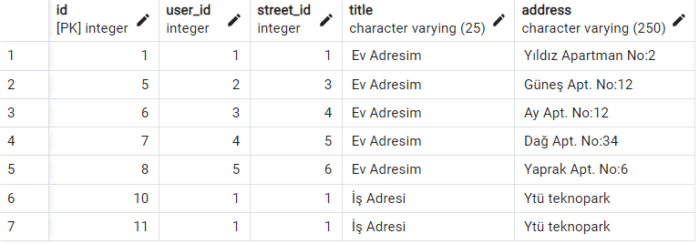

## ✨Inner Join
```
> select pt.name             as "Ödeme Yöntemi",
d.name              as "Teslimat Seçeneği",
i.number            as "Fatura Numarası",
i.created_date      as "Fatura Oluşturma Tarihi",
pr.name             as "Ürün Adı",
pr.unit_price       as "Ürün Fiyatı",
pr.stock            as "Ürün Stok Bilgisi",
oi.quantity         as "Ürün Adedi",
oi.item_total_price as "Ürün Toplam Fiyatı",
ad.title            as "Adres Başlığı",
ad.address          as "Açık Adres",
s.name              as "Sokak",
di.name             as "Mahalle",
t.name              as "İlçe",
ci.name             as "Şehir",
co.name             as "Ülke"
from orders o
inner join payments p
on o.id = p.id
inner join payment_types pt
on p.payment_type_id = pt.id
inner join invoices i
on o.id = i.id
inner join delivery_options d
on o.delivery_options_id = d.id
inner join order_items oi
on o.id = oi.order_id
inner join products pr
on oi.product_id = pr.id
inner join addresses ar
on o.order_address_id = ar.id
inner join addresses ad
on o.invoice_address_id = ad.id
inner join streets s
on ad.street_id = s.id
inner join districts di
on s.district_id = di.id
inner join towns t
on di.town_id = t.id
inner join cities ci
on t.city_id = ci.id
inner join countries co
on ci.country_id = co.id
```


## ✨Left Join
```
> select * from product_categories p
	left join products pr
    	on p.product_id = pr.id
```


## ✨Right Join
```
> select * from product_categories p
    right join categories c
        on p.category_id = c.id
```


## ✨Full Outer Join
```
> select *
from product_categories p
    full outer join categories c
       on p.category_id = c.id
	full outer join products pr
       on p.product_id = pr.id
```


## ✨ 1-) İstanbul ve Ankarada yaşayan müşterileri listeleyin
```
select ci.name as "Şehir", us.email, ind.first_name, ind.last_name  
from customers c
inner join individual_customers ind
on ind.id=c.id
inner join users us
on c.id=us.id
inner join addresses ad
on ad.user_id=us.id
inner join streets st
on ad.street_id=st.id
inner join districts di
on st.district_id=di.id
inner join towns t
on di.town_id = t.id
inner join cities ci
on t.city_id = ci.id
Where ci.name in('Ankara','İstanbul')
```


## ✨ 2-) 100 TL ve 200 TL arasında bulunan ürünlerin isimleri ve fiyatlarını listeleyen sorgu
```
Select name, unit_price from products
where unit_price between 100 and 200
```



## ✨ 3-) Şehirlerdeki müşteri sayısını getiren sorgu
```
select ci.name as "Şehir",count(*) "Müşteri Sayısı"   from customers c
inner join individual_customers ind
on ind.id=c.id
inner join users us
on c.id=us.id
inner join addresses ad
on ad.user_id=us.id
inner join streets st
on ad.street_id=st.id
inner join districts di
on st.district_id=di.id
inner join towns t
on di.town_id = t.id
inner join cities ci
on t.city_id = ci.id
group by ci.name
```


## ✨ 4-) Son üç siparişin ortalama fiyitanı getiren sorgu
```
select avg(total_price) from orders  
limit 3
```


## ✨ 5-) Insert ile veri ekleme sorgusu
```
insert into
addresses (user_id, street_id,title,address)
values ('1','1','İş Adresi','Ytü teknopark')
```



## ✨ 6-) Hangi ürünün hangi kategoride olduğunu gösteren sorgu
```
select c.name as "Kategori",pr.name as "Ürün" from product_categories pc
inner join products pr
on pc.id=pr.id
inner join categories c
on c.id= pr.id
group by c.name,pr.name
```


## ✨ 7-) ürünün fiyatını güncelleyen sorgu
```
update products set unit_price=175, image_url='https/product'
where unit_price=150
```


## ✨ 8-) Seçilen içeriği silen sorgu
```
delete from delivery_options
where id=4
```


## ✨ 9-) Baş harflerine göre sehir listesini getiren sorgu
```
select name from cities
where name
between 'A' and 'E'
order by name asc
```


 
## ✨ 10-) Baş harflerine göre sehir listesini getiren sorgu
```
select sum(shipping_price) from baskets
```
