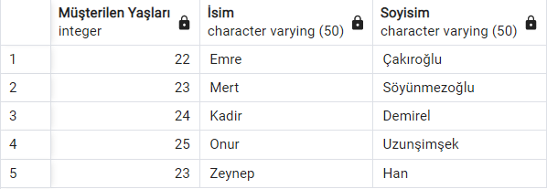
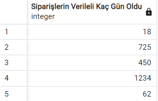

### İki tarih arası farkı hesaplayan fonksiyon -> date_diff()

```
CREATE FUNCTION date_diff(date_part VARCHAR (10), date1 TIMESTAMP, date2 TIMESTAMP)
    RETURNS INT AS $$

DECLARE
years INT = 0;
months INT = 0;
days INT = 0;
BEGIN

    years = DATE_PART('year', date2) - DATE_PART('year', date1);
    IF
	date_part IN ('year')  THEN
      RETURN years;
    END IF;
	
    months = (DATE_PART('month', date2) - DATE_PART('month', date1));
    IF
	date_part IN ('month')  THEN
      RETURN (years * 12 + months);
    END IF;

    days= DATE_PART('day', DATE_TRUNC('day', date2) - DATE_TRUNC('day', date1));
    IF
	date_part IN ('day') THEN
      RETURN days;
    END IF;

RETURN 0;
END;
$$
LANGUAGE plpgsql;
```

```
select date_diff('year', birth_date, current_date) as "Müşterilen Yaşları",
ic.first_name as "İsim", ic.last_name as "Soyisim" from individual_customers ic
```



```
select date_diff('month', employment_date, current_date) as "Kaç Ay Önce İşe Girdiği", 
u.email from employees e
inner join users u
on e.id = u.id
```


```
select date_diff('day', order_date, current_date) as "Siparişlerin Verileli Kaç Gün Oldu" from orders
```



### Siparişlerin Sayısını Belirtilen Id Aralığına Göre Getiren Fonksiyon (Id sayısını döndürür)

```
create function get_order_count(start_id int, end_id int)
    returns int
    language plpgsql as $$
  declare
  order_count integer;
  begin
    select count(*)
    into order_count
    from orders
    where id between start_id and end_id;

    return order_count;
end;
$$;
```

```
select get_order_count(1,4)
```


### Bireysel müşteri tablosunun alanlarının sanallaştırılması

```
create view customersView as
select ic.first_name as "Ad", ic.last_name as "Soyad", c.number as "Müşteri Numarası", us.email as "Eposta"
from individual_customers ic
inner join customers c
on ic.id = c.id
inner join users us
on c.id = us.id

```

```
select * from customersView
```

### Siparişlerin sanallaştırılması

```
create view ordersView as
select pt.name             as "Ödeme Yöntemi",
d.name              as "Teslimat Seçeneği",
i.number            as "Fatura Numarası",
i.created_date      as "Fatura Oluşturma Tarihi",
pr.name             as "Ürün Adı",
pr.unit_price       as "Ürün Fiyatı",
pr.stock            as "Ürün Stok Bilgisi",
oi.quantity         as "Ürün Adedi",
oi.item_total_price as "Ürün Toplam Fiyatı",
ad.title            as "Adres Başlığı",
ad.address          as "Açık Adres",
s.name              as "Sokak",
di.name             as "Mahalle",
t.name              as "İlçe",
ci.name             as "Şehir",
co.name             as "Ülke"
from orders o
inner join payments p
on o.id = p.id
inner join payment_types pt
on p.payment_type_id = pt.id
inner join invoices i
on o.id = i.id
inner join delivery_options d
on o.delivery_options_id = d.id
inner join order_items oi
on o.id = oi.order_id
inner join products pr
on oi.product_id = pr.id
inner join addresses ar
on o.order_address_id = ar.id
inner join addresses ad
on o.invoice_address_id = ad.id
inner join streets s
on ad.street_id = s.id
inner join districts di
on s.district_id = di.id
inner join towns t
on di.town_id = t.id
inner join cities ci
on t.city_id = ci.id
inner join countries co
on ci.country_id = co.id
```

```
select * from ordersView
```
